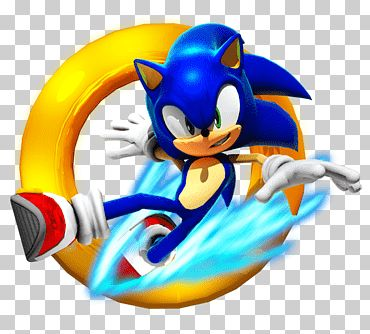
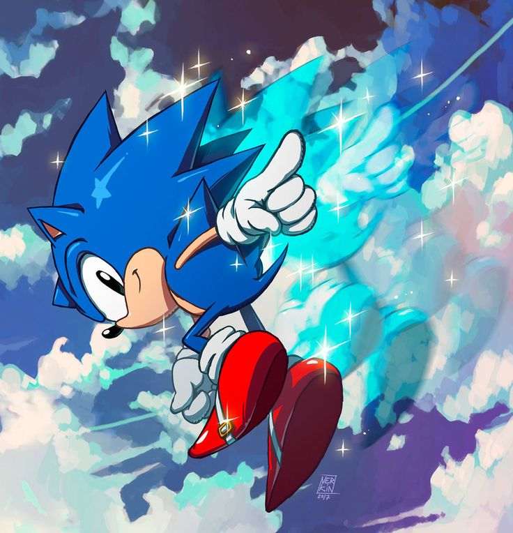
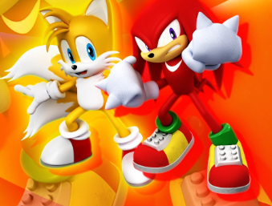
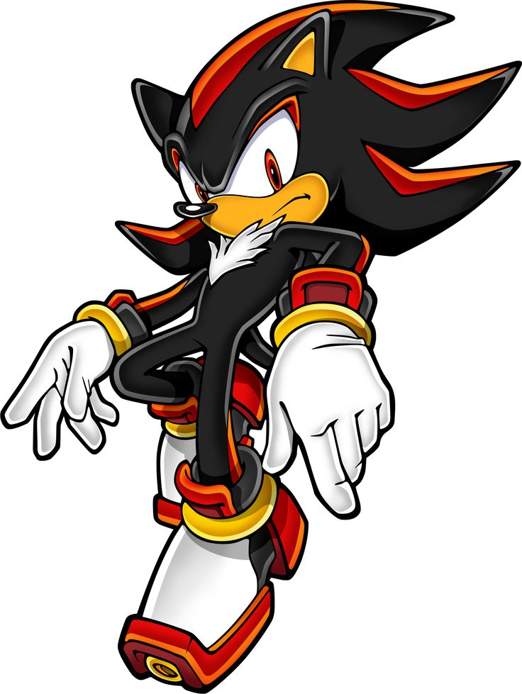

<!DOCTYPE html>
<html lang="es">
<head>
    <meta charset="UTF-8">
    <meta name="viewport" content="width=device-width, initial-scale=1.0">
    <title>Sonic</title>

    
</head>

<body>

    <h1>Sonic the Hedgehog</h1>
    
El erizo más rápido del mundo

    

        <h1>Imagen de Sonic</h1>
        
        

            
<strong>Personaje:</strong> Sonic

            
<strong>Compañía:</strong> SEGA

            
<strong>Habilidad:</strong> Súper velocidad

        

    

    

        Sonic es un personaje de videojuegos creado por SEGA. Es conocido por su increíble velocidad,
        su actitud confiada y su lucha constante contra el villano Dr. Eggman. Vive aventuras en
        distintos mundos llenos de acción, anillos dorados y enemigos mecánicos.
    

    

        
    

    

        Sonic suele estar acompañado por sus amigos como Tails y Knuckles. Juntos enfrentan amenazas
        que buscan dominar el mundo. Su principal misión es detener los planes de Eggman y proteger
        la libertad.
    

    

        
    

    

    <!-- SECCIÓN SHADOW -->
    

        <h1>Shadow the Hedgehog</h1>

        

        

            
<strong>Personaje:</strong> Shadow

            
<strong>Alias:</strong> La forma de vida definitiva

            
<strong>Habilidad:</strong> Chaos Control

        

    

    

        Shadow the Hedgehog es uno de los personajes más importantes del universo de Sonic.
        Fue creado por el Profesor Gerald Robotnik como la "forma de vida definitiva".
        A diferencia de Sonic, Shadow tiene una personalidad más seria, fría y enfocada.
    

    

        
    

    

        Shadow posee habilidades similares a Sonic, pero además puede utilizar el poder del
        Chaos Control gracias a las Chaos Emeralds, lo que le permite teletransportarse y
        manipular el tiempo. Aunque a veces actúa como rival, también ha sido aliado en
        múltiples ocasiones para salvar el mundo.
    

    

    

    <h1>Sonic en Acción</h1>

    <video controls autoplay muted loop width="600">
        <source src="sonic_video.mp4" type="video/mp4">
    </video>

    

        Sonic puede correr a velocidades supersónicas, lo que le permite esquivar ataques,
        explorar mundos rápidamente y derrotar enemigos en segundos. Su energía y actitud
        lo convierten en uno de los personajes más icónicos de los videojuegos.
    

    

        Referencias: 
        <a href="https://es.wikipedia.org/wiki/Sonic_the_Hedgehog" target="_blank">
            Sonic en Wikipedia
        </a>
    

</body>
</html>
